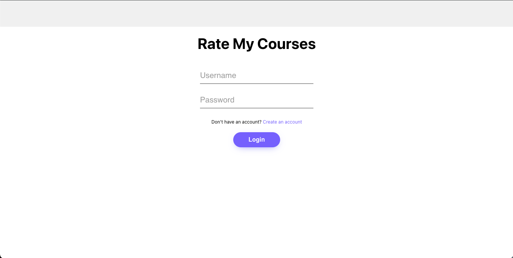
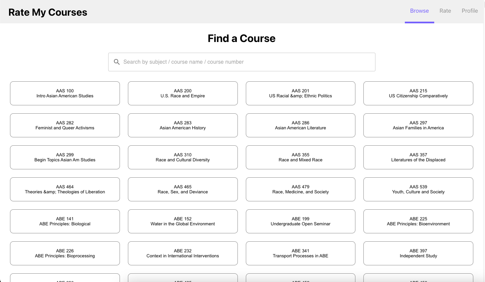
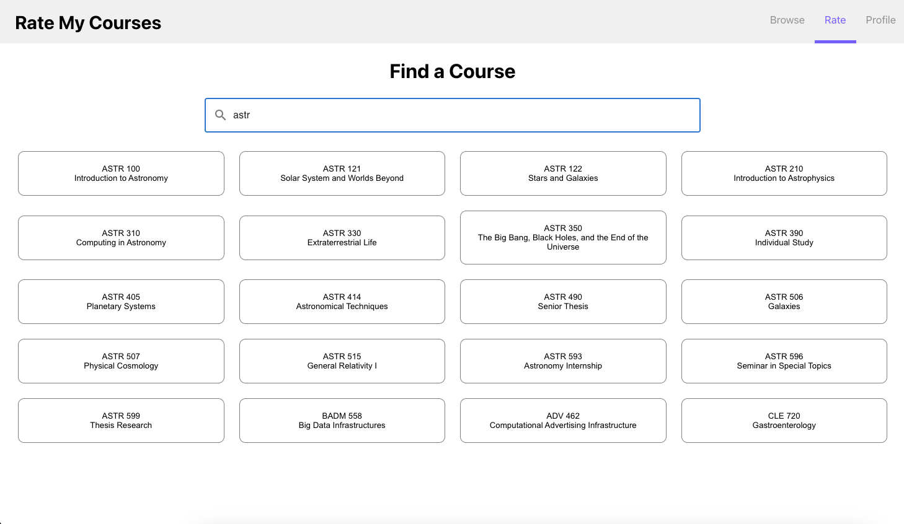
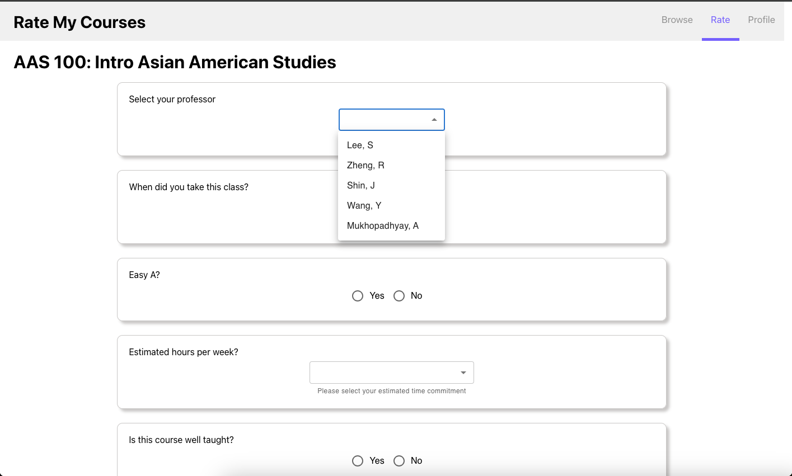

# Rate my Courses

**Team Name**: Wacky Web Wizards 

**Team Members**: Serlina Ku (sku6), Serena Gong (sxgong2), Adrianne Sun (ajsun2), Wendy Ruan (wruan), Kelly Shih (kshih7)

**Technologies Utilised**: Javascript, React.js, Node.js, Express.js, Google Cloud Platform, MySQL Database, Gitlab CI/CD

**URL**: ~~https://unique-alpha-407002.uc.r.appspot.com/~~ Website no longer active

**Images of the product:**

## About Our Project

### Problem Statement + Motivation
We want to create a more personal and student focused course explorer app with real student feedback. Oftentimes students can search for classes on course explorer, but it doesn’t really give great insight on the course aside from basic course details and its course description. A lot of students have to rely on online forums or word of mouth to discover recommended courses by their peers or upperclassmen. 

### User problems that we are solving
* The current course explorer is not being tailored specifically for the student body 
* UIUC currently lacks a centralized place for student course feedback, there is a dependence on browsing forums like Reddit or word of mouth from friends
* Give students more insight on the course to better determine their desired schedule

### Other apps that are similar
* Course Explorer
* Rate My Professor

### How our app is different
Our app will be a more student-friendly and interactive version of Course Explorer. We will have similar functionalities but students will be able to rate courses they have taken in the past on a scale of 0 to 5 stars and leave comments/feedback about the class. In addition to course information, the average of all student ratings will be displayed when a user searches up a class they are interested in learning more about. Students will be able to use the ratings and browse comments to determine if they want to take a class or not, similar to how Rate My Professor works but for classes instead of professors. 
